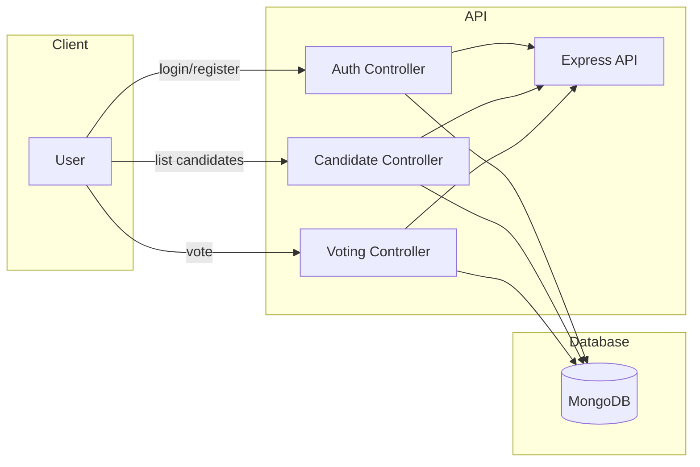

# Voting System ✅

[](LICENSE) [](https://nodejs.org/) [](https://www.npmjs.com/)


A clean, minimal, and extendable Voting System built with Node.js, Express and MongoDB — designed as a demo project and starter template for small voting applications and educational use. This repository contains backend code for user authentication, candidate management, and voting workflows.

---

## Table of Contents 📚

- [Features](#features)
- [Tech Stack](#tech-stack)
- [Architecture / Flowchart](#architecture--flowchart)
- [Getting Started](#getting-started)
- [Environment Variables](#environment-variables)
- [API Endpoints (Quick)](#api-endpoints-quick)
- [Project Structure](#project-structure)
- [Contributing](#contributing)
- [License](#license)

---

## Features ✨

- **User authentication** (register, login) with hashed passwords
- **Candidate management**: add, list candidates
- **Voting**: cast votes and retrieve results
- Clear and **modular project structure** for easy extension
- **Developer friendly**: scripts for development and production

---

## Tech Stack 🧰

- Node.js + Express
- MongoDB (Mongoose)
- dotenv for configuration

---

## Architecture / Flowchart 🧭

Below is a high-level flow describing how requests move through the system.



> Note: If your Markdown viewer does not render Mermaid, see the ASCII fallback below:

User -> API -> {Auth, Candidates, Voting} -> MongoDB

---

## Getting Started 🔧

### Prerequisites

- Node.js (v14+ recommended)
- npm or yarn
- MongoDB (local or Atlas)

### Install

```bash
git clone <your-repo-url>
cd Voting_System/Server
npm install
```

### Run (development)

```bash
cp .env.example .env # create .env file from example
npm run dev
```

### Run (production)

```bash
npm start
```

---

## Environment Variables 🗝️

Create a `.env` file in `Server/` and set the following (example):

```
PORT=3000
MONGO_URI=mongodb://localhost:27017/voting_system
JWT_SECRET=your_jwt_secret_here
```

---

## API Endpoints (Quick) 🚀

> Base URL: `http://localhost:3000` (unless overridden by `PORT`)

### Auth

- POST `/api/auth/register` — Register a new user
- POST `/api/auth/login` — Login and receive JWT

Register example:

```bash
curl -X POST http://localhost:3000/api/auth/register \
  -H "Content-Type: application/json" \
  -d '{"username":"alice","password":"secret"}'
```

Login example:

```bash
curl -X POST http://localhost:3000/api/auth/login \
  -H "Content-Type: application/json" \
  -d '{"username":"alice","password":"secret"}'
```

### Candidates

- GET `/api/candidates` — List candidates
- POST `/api/candidates` — Add candidate (protected)

### Voting

- POST `/api/vote` — Cast a vote (protected)
- GET `/api/results` — Get aggregated results

---

## Project Structure 🔍

Important folders and files (top-level `Server/`):

```
Server/
├─ app.js
├─ server.js
├─ package.json
├─ src/
│  ├─ config/mongodb.config.js
│  ├─ controllers/
│  │  ├─ auth.controller.js
│  │  ├─ candidate.controller.js
│  │  └─ voting.controllers.js
│  ├─ middleware/auth.middleware.js
│  ├─ models/
│  │  ├─ candidates.model.js
│  │  └─ user.model.js
│  └─ routes/
│     ├─ auth.route.js
│     ├─ candidate.route.js
│     └─ voting.route.js
```

---

## Contributing 🤝

Contributions are welcome! Please follow standard GitHub flow:

1. Fork the repo
2. Create a feature branch
3. Open a PR with a clear description

---

## License 📄

This project is licensed under the MIT License — see the `LICENSE` file for details.

---

If you'd like, I can also:

- Add images/screenshots to the repo
- Generate a prettier SVG flowchart and commit it to `Assets/`
- Expand the API docs into a dedicated `docs/` folder (OpenAPI / Postman collection)

---

**Enjoy building!** ✨

Maintainer: `Priyanshu` • Contact: bhattpriyanshupcm007@gmail.com
